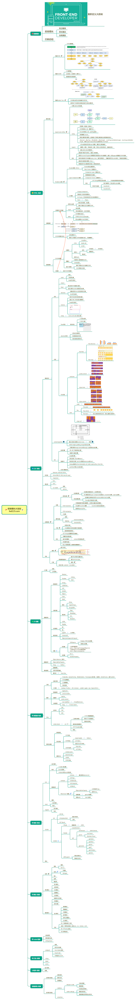

## 适宜人群
前端初学者，想要提高却不得门道的前端开发同学，找工作面试准备，前端知识脉络梳理
精心打造全新课程，欢迎吐槽！反馈宝贵意见！

在线课程： 
[网易云课堂课程](https://study.163.com/course/courseMain.htm?courseId=1209400904)      
[思否课堂](https://segmentfault.com/ls/1650000019681091)

## 课程说明
前端知识点很多，很细碎。一般同学都是死记硬背一些知识点。机灵的同学会背一些案例，更聪明的同学会背一下原理，理解下大概。奈何时光催人老，再好的记忆也会有忘记的时候，况且人生的不同阶段所侧重的点也不一样。

所以本课程从面试考察的知识点入手，梳理前端知识点脉络，精讲各个点的长问问题和设计原理，让你从死记硬背转化为理解，实现前端能力增长。再也不需要死记硬背，该忘记就忘记吧，有事没事想一想，捋一捋就行。

官方博客：前端学堂（fed123.com）
目前课程【更新中】特价活动赶紧加入吧！

## 课程大纲
第一章 HTML-相识
1.1 解析流程
1.2 Render进程渲染原理
1.3 加载阻塞
1.4 渲染阻塞

第二章 CSS-相知
2.1 定位和布局
2.2 BFC和Containing Block
2.3 优先级和预处理
2.4 动画渲染与优化
2.5 字体

第三章 JavaScript-相爱 【7月20更新】

第四章 浏览器-相生 【7月20更新】

第五章 框架-相克 【8月10更新】

第六章 编码能力-相辅 【8月10更新】

第7章 NodeJs-相成 【8月20更新】

第8章 打包-相情 【8月20更新】

第9章  小程序-相怨【8月20更新】

第10章  前端架构-相恨 【8月20更新】

## 知识图谱
前端增长大宝剑-知识图谱, 详细可以用xmind打开课件细看。持续更新。。。

